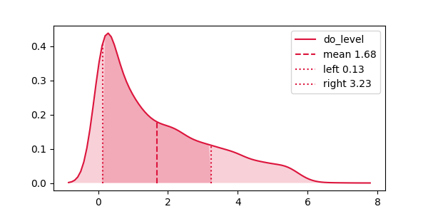

# ainwater-package: etl, estadísticas y visualización de datos.

Ainwater-package es un paquete que incluye varias librerías de funciones en Python para realizar transformación, visualización y estadísticas de datos de procesos de tratamiento de aguas. 

Los contenidos de este paquete están divididos en:

# Tabla de contenidos
1. [Librería de etl](#librería-de-etl) 
2. [Visualización de gráficos](#visualización-de-gráficos) 
3. [Estadísticas](#estadísticas)

======================================================================================
# Librería de etl
Example text blah. Example text blah. Example text blah. Example text blah. 
Example text blah. Example text blah. Example text blah. Example text blah. 
Example text blah. Example text blah. Example text blah. Example text blah. 
Example text blah. Example text blah. 

# Visualización de gráficos
El fichero  ``graphics_functions.py`` es la librería que almacena funciones para visualizar gráficos de densidad, de cajas, de lineas, y de puntos. Los gráficos pueden ser simples o multiples.

``import graphics_functions as fn``

### 1.Gráficos kdeplots
Los gráficos de densidad visualizan la distribución de datos en un intervalo o período de tiempo continuo. Este gráfico es una variación de un Histograma que usa el suavizado de cerner para trazar valores, permitiendo distribuciones más suaves al suavizar el ruido.

- [simple_kdeplot](#simple_kdeplot)
- [multiple_kdeplot](#multiple_kdeplot)
- [plot_distribution_hue](#plot_distribution_hue)

#### simple_kdeplot
Permite realizar analisis univariado de la distribucion de observaciones en un conjunto ded datos, la representacion gráfica se realiza por medio de la curva de densidad de probabilidad contínua. Adicionalmente entrega estadísticos como la media y valores que se encuentran por debajo y arriba de una desviacion estandar. Usa la función kdeplot() de seaborn para graficar una función de densidad de la manera siguiente:-

``fn.simple_kdeplot(df, column_name)``

 Donde df es el dataframe donde está la data y column_name el nombre de la variable  visualizar.Como resultado se obtiene la siguiente gráfica. 
 

===============================================================================
### 2.Gráficos lineplot
Histograms represent the data distribution by forming bins along the range of the data and then drawing bars to show the number of observations that fall in each bin.

We can use the same distplot() function to plot a histogram as follows:-

sns.distplot(tips['total_bill'], kde=False)

plt.show()

The kde parameter is set to false. As a result, the representation of the kernel estimation plot will be removed and only histogram is plotted.

# Estadísticas
efsjfsjfkjskdjfksjdfk
jdhfjdhfjhdjsk
jshjfshdfjshfjshf
sjfhsjdfhsjhdfsk

